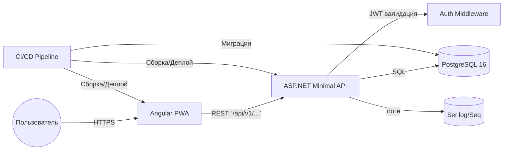

# 🧩 FitTrack UA+ — Архитектура проекта

_Версия 2.0 · 2025-10-29_

## Обновлённый обзор
FitTrack UA+ — это кроссплатформенное **Progressive Web App**-решение, сочетающее современный фронтенд на Angular с надёжным сервером на ASP.NET API. Клиентская часть обеспечивает офлайн-доступ и синхронизацию, а сервер взаимодействует с PostgreSQL 16 через Dapper и предоставляет защищённый REST-интерфейс. Полный цикл поставки поддерживается CI/CD-пайплайном, покрывающим сборку, тестирование и деплой.

### Основные компоненты
- **Frontend:** Angular 18 PWA с Angular Material, offline-кэшем на Dexie/IndexedDB и сервис-воркерами для пуш-уведомлений.
- **Backend:** ASP.NET 8 Minimal API c Dapper для доступа к данным, конфигурируемыми middleware и интеграцией с системами логирования.
- **Database:** PostgreSQL 16, миграции управляются FluentMigrator; используются схемы для логического разделения данных и расширения.
- **Аутентификация и авторизация:** JWT-токены, refresh-токены и BCrypt для хэширования паролей.
- **CI/CD:** Автоматизированный пайплайн (GitHub Actions) с проверками качества, сборкой контейнеров и деплоем в целевые окружения.

---

## 🎯 Цели проекта
- Упростить контроль питания, гидратации и нутрицевтического баланса.
- Предоставить пользователям единый опыт на любых устройствах с офлайн-доступом и бесшовной синхронизацией.
- Обеспечить высокую безопасность и доступность сервиса за счёт автоматизированного тестирования и деплоя.
- Подготовить архитектуру к масштабированию по функциям и нагрузке без серьёзных изменений.

---

## ⚙️ Архитектурные компоненты
```
fittrack-ua/
├── client/ (Angular PWA)
│   ├── core/            → сервисы авторизации, interceptors, guards
│   ├── shared/          → переиспользуемые компоненты и утилиты
│   ├── features/        → функциональные домены (diary, water, vitamins, reminders, stats)
│   ├── assets/          → локализации, темы, статические ресурсы
│   └── environments/    → конфигурации окружений
│
└── server/ (ASP.NET 8 API)
    ├── Api/             → endpoints Minimal API, фильтры, versioning
    ├── Application/     → бизнес-логика, обработчики команд/запросов
    ├── Infrastructure/  → Dapper-репозитории, FluentMigrator, интеграции
    └── Common/          → DTO, контракты, настройки
```

---

## 🧠 Frontend (Angular PWA)

### Технологии и паттерны
- **Angular 18** с модульной архитектурой и lazy loading.
- **@angular/pwa** и сервис-воркеры для кэширования, офлайн-режима и пушей.
- **Angular Material** и **Tailwind** (опционально) для UI-компонентов и адаптивности.
- **Dexie.js** как обёртка над IndexedDB для локального хранения и очередей синхронизации.
- **RxJS** для реактивного управления состоянием и запросами.

### Основные области функциональности
- `diary` — трекинг питания, дневники приёмов пищи, калорийность и макросы.
- `water` — учёт гидратации, напоминания и цели по воде.
- `vitamins` — отслеживание нутрицевтических планов и статусов.
- `reminders` — управление уведомлениями, настройка времени и каналов доставки.
- `stats` — аналитика, графики, экспорт отчётов.

### Клиентские сервисы
- HTTP-интерсепторы добавляют JWT, обрабатывают ошибки и инициируют обновление токенов.
- Sync-сервис использует фоновые задачи (Background Sync API) для отправки данных при восстановлении сети.
- Guard'ы проверяют права доступа и состояние аутентификации на маршрутах.

---

## ⚙️ Backend (ASP.NET API + Dapper)

### Технологический стек
- **ASP.NET 8 Minimal API** с модульной структурой endpoints и middleware.
- **Dapper** для лёгкого и производительного доступа к PostgreSQL.
- **FluentMigrator** и seed-скрипты для миграций и первичных данных.
- **Serilog**/**Seq** (конфигурируется) для логирования и трассировки запросов.

### Основные подсистемы
- **Endpoints** — организованы по доменам, используют конвейер валидации и фильтры.
- **Application Services** — инкапсулируют бизнес-правила, используют CQRS-подход для команд и запросов.
- **Repositories** — реализованы на Dapper, скрывают SQL-операторы и обеспечивают транзакционность через `IDbTransaction`.
- **Background jobs** — отправка уведомлений и очистка данных (интеграция с Hangfire или встроенными `PeriodicTimer`).

### Кэширование и интеграции
- Поддерживается кэширование результатов (Redis или встроенный MemoryCache) для тяжёлых отчётов.
- Интеграция с внешними API (например, справочники продуктов) оформляется через изолированные адаптеры.

---

## 🗄 Database (PostgreSQL 16)

### Ключевые сущности
- `users` — профиль пользователя, настройки, статусы подписок.
- `food_entries` — журналы питания с детализацией макро- и микронутриентов.
- `water_entries` — события потребления жидкости, цели и напоминания.
- `vitamin_regimens` — планы приёма витаминов, расписания, статусы выполнения.
- `reminders` — расписания уведомлений, тип канала и связанный контент.

### Особенности реализации
- Использование **JSONB** для хранения гибких нутриентных профилей и пользовательских настроек.
- Уровни изоляции транзакций `READ COMMITTED` с оптимизированными индексами по `user_id`, `date` и `status`.
- Полнотекстовый поиск по справочнику продуктов через `tsvector`.
- Миграции управляются через FluentMigrator и интегрированы в CI/CD для автоматического применения.

---

## 🔐 Аутентификация и авторизация
- **JWT Bearer** с claim-based доступом.
- **Refresh-токены** с привязкой к устройству, хранением в защищённых HttpOnly cookie.
- **BCrypt** для хэширования паролей и валидации.
- Поддержка OAuth2/Social-login рассматривается как расширение (через отдельные провайдеры).

---

## 🌐 API и версионирование
Все REST-эндпоинты доступны по базовому префиксу `/api/v1/...`. Версия инкапсулирует схему данных и контракт ответов, что позволяет выпускать изменения без нарушения обратной совместимости. Переход на последующие версии (`/api/v2/...`) будет осуществляться параллельным развёртыванием новых маршрутов и депрекацией старых.

| Method | Endpoint | Назначение |
|---------|-----------|-------------|
| GET | `/api/v1/food` | получение дневника питания |
| POST | `/api/v1/food` | добавление записи о приёме пищи |
| GET | `/api/v1/water/today` | состояние гидратации за текущий день |
| POST | `/api/v1/water` | фиксация потребления воды |
| GET | `/api/v1/vitamins/balance` | актуальный статус витаминного плана |
| POST | `/api/v1/reminders` | создание или обновление напоминания |
| POST | `/api/v1/auth/refresh` | обновление JWT по refresh-токену |

### Контракты и документация
- Описываются через **Swagger/Swashbuckle**, публикуются в CI/CD как часть артефактов.
- Автоматические тесты проверяют соответствие контрактов и схемы БД.

---

## 🔄 Диаграмма взаимодействия компонентов


---

## 🔒 Практики безопасности
- **HTTPS везде:** все окружения обслуживаются через TLS, сертификаты обновляются автоматически.
- **Валидация и санитайзинг:** DTO проходят серверную и клиентскую валидацию, входные данные очищаются от инъекций.
- **Ограничение частоты:** rate limiting на уровне API предотвращает brute-force и злоупотребления.
- **Защита данных:** секреты хранятся в защищённых хранилищах (Azure Key Vault/HashiCorp Vault), резервные копии шифруются.
- **Мониторинг и оповещения:** интеграция с SIEM для отслеживания аномалий и уведомлений.

---

## ☁️ CI/CD и развёртывание
- **Pipeline:** GitHub Actions выполняет линтинг, юнит-тесты, сборку Docker-образов и публикацию артефактов.
- **Контейнеризация:** frontend и backend пакуются в отдельные образы; orchestrator (Docker Compose/Kubernetes) управляет окружениями.
- **Инфраструктура:** production размещается на управляемых Kubernetes-кластерах или VPS (DigitalOcean/Azure); фронтенд обслуживается через CDN.
- **Непрерывные миграции:** перед деплоем API запускает миграции FluentMigrator, контролируя совместимость схемы.
- **Наблюдаемость:** Prometheus + Grafana/Elastic Stack для мониторинга, Alertmanager для оповещений.

---

## 📌 Итог
FitTrack UA+ версии 2.0 — это модульная, защищённая и масштабируемая платформа для управления питанием, водой и витаминными программами. Современный Angular PWA, производительный ASP.NET API с Dapper, надёжная PostgreSQL 16 и CI/CD-пайплайн обеспечивают стабильность, безопасность и гибкость развития продукта.
